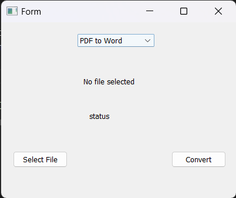

# File Conversion Tool

A PyQt5-based application that provides multiple file conversion functionalities. Easily convert between popular file formats such as PDF, Word, Excel, Images, and more.

## Details

The application is built using Python's PyQt5 framework, which offers a robust set of tools to create desktop GUI applications. The backend conversion functionalities make use of various Python libraries.

### Modules to be Installed:
- `PyQt5`: For the GUI framework.
- `xlrd`: For reading `.xls` Excel files.
- `easyocr`: For OCR capabilities.
- `Pillow`: For image processing.
- `python-docx`: For Word document operations.
- `docx2pdf`: To convert between Word documents and PDFs.
- `gTTS`: To convert text to audio.
- `openpyxl`: For reading `.xlsx` Excel files.
- `pdfminer.six`: To extract text from PDFs.

To install all required modules at once run:pip install PyQt5 xlrd easyocr Pillow python-docx docx2pdf gTTS openpyxl pdfminer.six

## Features
- **PDF to Word**: Convert PDF files into editable Word documents.
- **Word to PDF**: Convert Word documents into PDFs.
- **Excel to Word**: Extract content from Excel sheets and save as Word documents.
- **Image to PDF**: Convert images into PDFs.
- **Image Text Extraction**: Use OCR to extract text from images.
- **Text to Audio**: Convert text files into MP3 audio.

## Getting Started
1. Clone the repository: git clone https://github.com/Bisalkumar/Converter.git

## How to Use
1. Run the `main.py` script to start the application.
2. Using the GUI, choose the desired conversion type from the dropdown.
3. Select a file for conversion using the "Select File" button.
4. Click "Convert" to start the conversion process. Once done, the converted file will be saved in the `output/` directory.

## Screenshots

## Contributions
Feel free to fork this project and make your own changes. If you have ideas or feature requests, please create an issue.

## License
This project is licensed under the MIT License - see the [LICENSE](LICENSE) file for details.

## Acknowledgements
- Thanks to the developers and maintainers of all the Python libraries utilized in this project.
- Special shoutout to the PyQt5 community for their extensive resources and tutorials.